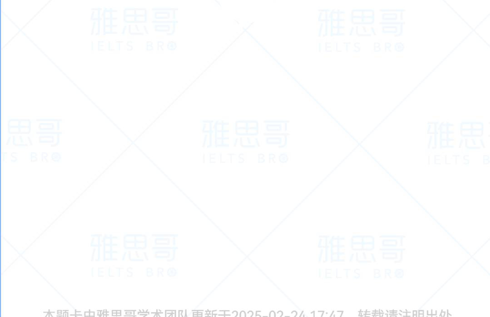

# Electronic devices/Technology  

# Part1  

1.What technology do you often use,computers or cellphones?  

2. What electronic devices have you bought lately?   
3. Is there any technology you want to buy?   
4. Is technology important in your life?   
5. Is there any technology you don't like?   
6. What do you think are the trends in technology   
today compared to when you were young?  

温馨提示：疑似新题待确认，随时关注更新哦！  

  

本题卡由雅思哥学术团队更新于2025-02-2417:47，转载请注明出处  